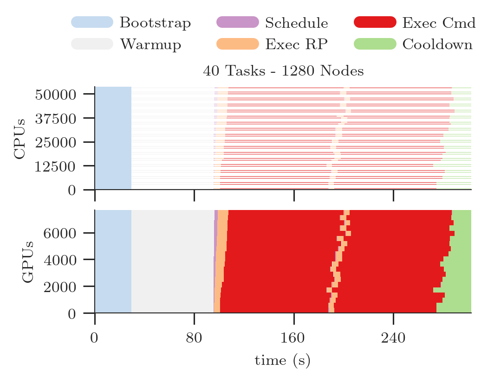

.. _chapter_resource_utilization:

Resource Utilization
====================

RADICAL-Analytics (RA) support calculating resource utilization for single and multiple sessions produced by RADICAL-Pilot. Currently, RA supports CPU and GPU resources but in the future may support also RAM, I/O and so on.

Resource utilization is expressed as the amount of time for which each task and pilot utilized available resources. For example, ``task_000000`` may have used 6 GPUs and 1 core for 15 minutes, and ``pilot_0000`` may have utilized (better, held) all the available resources for 1 hour.

RA can further characterize resource utilization by differentiating among the state in which each task and pilot was when utilizing (or holding) available resources. For example, ``pilot_0000`` may have held all the available resources for 5 minutes while bootstrapping or a variable amount of resources while scheduling each task. Similarly, tasks may held resources while being in a pre_execution or cmd_execution state.

Calculating resource utilization for all the entities and all their states is computationally expensive: given a 2020 laptop with 8 cores and 32GB of RAM, RA takes ~4 hours to plot the resource utilization of 100,000 heterogeneous tasks executed on a pilot with 200,000 CPUs and 24,000 GPUs. For sessions with 1M+ tasks, RA cannot be utilized to plot completed resource utilization in a reasonable amount of time.

Thus, RA offers two ways to compute resource utilization: fully detailed and aggregated. In the former, RA calculates the utilization for each core (e.g., core and GPU); in the latter, RA calculates the aggregated utilization of the resources over time, without mapping utilization over resource IDs. Aggregated utilization is less computationally intensive and it has been used to plot runs with 10M+ tasks.

Plotting Detailed Resource Utilization
--------------------------------------

Given a RADICAL-Pilot session, RA helper functions take one resource type as input and return utilization, patches and legends for that type of resource. Plotting multiple types of resources requires creating separate plots. If needed, plots can be stacked, maintaining their time alignment. Here the default workflow to create a detailed utilization plot, with stacked plots for CPU and GPU resources.

Metrics
^^^^^^^

Define the metrics you want RA to use to calculate resource utilization of task(s) and pilot(s). A metric is used to measure the amount of time for which a set of resource was used by an entity in a specific state. The list of all available durations is in ``rp.utils.PILOT_DURATIONS``; ``rp.utils.TASK_DURATIONS_DEFAULT``; ``rp.utils.TASK_DURATIONS_APP``; ``rp.utils.TASK_DURATIONS_PRTE``; and ``rp.utils.ASK_DURATIONS_PRTE_APP``. Each metric has a label---the name of the metric---and a list of durations.

.. code-block:: python
   :linenos:

    metrics = [
        ['Bootstrap', ['boot', 'setup_1']                         , '#c6dbef'],
        ['Warmup'   , ['warm' ]                                   , '#f0f0f0'],
        ['Schedule' , ['exec_queue','exec_prep', 'unschedule']    , '#c994c7'],
        ['Exec RP'  , ['exec_rp', 'exec_sh', 'term_sh', 'term_rp'], '#fdbb84'],
        ['Exec Cmd' , ['exec_cmd']                                , '#e31a1c'],
        ['Cooldown' , ['drain']                                   , '#addd8e']
    ]

.. note:: One can use an arbitrary number of metrics, depending on the information that the plot needs to convey. For example, using only 'Exec Cmd' will show the time for which each resource was utilized to execute a given task. The rest of the plot will be white, indicating that the resources where otherwise utilized or idling.

.. warning:: Barring exceptional cases, colors should not be changed when using RA for RADICAL publications.

Experiment and Start Times
^^^^^^^^^^^^^^^^^^^^^^^^^^

Construct an ``ra.Experiment`` object and calculate the starting point of each pilot in order to zero the X axis of the plot. Without that, the plot would start after the time spent by the pilot waiting in the queue. The experiment object exposes a method to calculate the consumption of each resource for each entity and metric.

.. code-block:: python
   :linenos:

    # List of sessions of an experiment
    sids = ['../data/raw/incite2021/re.session.login1.lei.018775.0005']

    # Get the resource utilization of the experiment for each metics
    exp = ra.Experiment(sids, stype='radical.pilot')

    # Get the start time of each pilot
    p_zeros = ra.get_pilots_zeros(exp)

Legends and patches
^^^^^^^^^^^^^^^^^^^

We now have everything we need to plot the resource utilization with Matplotlib:

.. code-block:: python
   :linenos:

    # '252': LaTeX document column size (see RA Plotting Chapter)
    fig, axarr = plt.subplots(2, 1, figsize=(ra.get_plotsize(252)))

    # Type of resource we want to plot and service data structures
    rtypes = ['cpu', 'gpu']
    for i, rtype in enumerate(rtypes):

        # Resource resource provided and consumed: CPU and GPU
        _ , consumed, _, _, _ = exp.utilization(metrics=metrics, rtype=rtype)

        # Plot legend, patched, X and Y axes objects (assume one pilot)
        pid = sinfo['pid'][0]
        legend, patches, x, y = ra.get_plot_utilization(metrics,
                        consumed, p_zeros[sid][pid], sinfo['sid'], pid)

        # Place all the CPU and GPU patches, one for each metric,
        # on the respective axes
        for patch in patches[rtype]:
            axarr[i].add_patch(patch)

        # Format axes
        axarr[i].set_xlim([x['min'], int(x['max'])])
        axarr[i].set_ylim([y['min'], int(y['max'])])

        axarr[i].yaxis.set_major_locator(MaxNLocator(5))
        axarr[i].xaxis.set_major_locator(MaxNLocator(5))

        if rtype == 'cpu':
            # Specific to Summit when using SMT=4 (default)
            axarr[i].yaxis.set_major_formatter(mticker.FuncFormatter(lambda x,
                    pos: int(x/4)))

        # Resource-type dependend labels
        axarr[i].set_ylabel('%ss' % rtype.upper())
        axarr[i].set_xlabel('time (s)')

    # Do not repeat the X-axes label in the topmost plot
    for ax in fig.get_axes():
            ax.label_outer()

    # Title of the plot. Facultative, requires info about session
    # (see RA Info Chapter)
    axarr[0].set_title('%s Tasks - %s Nodes' % (sinfo['ntask'],
                       int(sinfo['nnodes'])))

    # Add legend for both plots
    fig.legend(legend, [m[0] for m in metrics],
               loc='upper center', bbox_to_anchor=(0.5, 1.15), ncol=3)

    # Save a publication-quality plot
    plt.savefig('figures/ru_single.pdf', dpi=300, bbox_inches='tight')

The code of the steps above produces the following plot (as png):

Multiple Sessions
^^^^^^^^^^^^^^^^^

With multiple sessions added to the variable ``sessions``, we can utilize subplots to create a single figure with multiple resource utilization plots:

.. code-block:: python
   :linenos:

    # List of RP sessions
    sids = [
        '../data/raw/incite2021/re.session.login1.lei.018775.0008',
        '../data/raw/incite2021/re.session.login1.lei.018775.0007',
        '../data/raw/incite2021/re.session.login1.lei.018775.0004',
        '../data/raw/incite2021/re.session.login1.lei.018775.0005'
    ]

    # Type of resource we want to plot: cpu or gpu
    rtypes=['cpu', 'gpu']

    exp = ra.Experiment(sids, stype='radical.pilot')

    # Get the start time of each pilot
    p_zeros = ra.get_pilots_zeros(exp)

    # Create figure and 1 subplot for each session
    # Use LaTeX document page size (see RA Plotting Chapter)
    nsids = len(sids)
    fwidth, fhight = ra.get_plotsize(516, subplots=(1, nsids))
    fig, axarr = plt.subplots(2, nsids, sharex='col', figsize=(fwidth, fhight))

    # Avoid overlapping between Y-axes ticks and sub-figures
    plt.subplots_adjust(wspace=0.45)

    # Generate the subplots with labels
    legend = None
    for k, rtype in enumerate(rtypes):

        _, consumed, _, _, _ = exp.utilization(metrics=metrics, rtype=rtype)

        j = 'a'
        for i, sid in enumerate(splot):

            # we know we have only 1 pilot
            pid = ss[sid]['p'].list('uid')[0]

            # Plot legend, patched, X and Y axes objects
            legend, patches, x, y = ra.get_plot_utilization(metrics, consumed,
                            p_zeros[sid][pid], sid, pid)

            # Place all the patches, one for each metric, on the axes
            for patch in patches:
                axarr[k][i].add_patch(patch)

            # Title of the plot. Facultative, requires info about session (see RA
            # Info Chapter). We set the title only on the first raw of plots
            if rtype == 'cpu':
                axarr[k][i].set_title('%s Tasks - %s Nodes' % (ss[sid]['ntask'],
                        int(ss[sid]['nnodes'])))

            # Format axes
            axarr[k][i].set_xlim([x['min'],     x['max']])
            axarr[k][i].set_ylim([y['min'], int(y['max'])])
            axarr[k][i].yaxis.set_major_locator(MaxNLocator(4))
            axarr[k][i].xaxis.set_major_locator(MaxNLocator(4))

            if rtype == 'cpu':
                # Specific to Summit when using SMT=4 (default)
                axarr[k][i].yaxis.set_major_formatter(
                        mticker.FuncFormatter(lambda z, pos: int(z/4)))

            # Y label per subplot. We keep only the 1st for each raw.
            if i == 0:
                axarr[k][i].set_ylabel('%ss' % rtype.upper())

            # Set x labels to letters for references in the paper.
            # Set them only for the bottom-most subplot
            if rtype == 'gpu':
                axarr[k][i].set_xlabel('(%s)' % j, labelpad=10)

            # update session id and raw identifier letter
            j = chr(ord(j) + 1)

    # Add legend
    fig.legend(legend, [m[0] for m in metrics],
            loc='upper center', bbox_to_anchor=(0.5, 1.25), ncol=5)

    # Add axes labels
    fig.text( 0.5 , -0.2, 'Time (s)', ha='center')

    # Save a publication quality plot
    plt.savefig('figures/incite_2021_ru.pdf', dpi=300, bbox_inches='tight')
    plt.savefig('figures/incite_2021_ru.png', dpi=300, bbox_inches='tight')

The code above produces the following plots:

Plotting Aggregated Resource Utilization
----------------------------------------

This method is still under development and, as a result, it requires to explicitly define the durations for each metric. Defaults will be included in ``rp.utils`` as done with the detailed plotting.

Metrics
^^^^^^^

The definition of metrics needs to be accompanied by the explicit definition of the event transitions represented by each metric. RP transitions are documented `here <https://github.com/radical-cybertools/radical.pilot/blob/devel/docs/source/events.md>`_ but default values will be made available at a later time.

.. code-block:: python
   :linenos:

    # pick and choose what resources to plot (one sub-plot per resource)
    resrc = ['cpu', 'gpu']

    # pick and choose what contributions to plot
    metrics  = [  #   metric,      line color, alpha, fill color, alpha
                    ['bootstrap'  , ['#c6dbef',  0.0,   '#c6dbef',  1  ]],
                    ['exec_cmd'   , ['#e31a1c',  0.0,   '#e31a1c',  1  ]],
                    ['schedule'   , ['#c994c7',  0.0,   '#c994c7',  1  ]],
                    ['exec_rp'    , ['#fdbb84',  0.0,   '#fdbb84',  1  ]],
                    ['term'       , ['#addd8e',  0.0,   '#addd8e',  1  ]],
                    ['idle'       , ['#f0f0f0',  0.0,   '#f0f0f0',  1  ]]
    ]

    # ------------------------------------------------------------------------------
    # transition events for pilot, task, master, worker, request
    #
    # event  : resource transitions from : resource transitions to
    #
    p_trans = [
            [{1: 'bootstrap_0_start'}     , 'system'     , 'bootstrap'  ],
            [{5: 'PMGR_ACTIVE'}           , 'bootstrap'  , 'idle'       ],
            [{1: 'cmd', 6: 'cancel_pilot'}, 'idle'       , 'term'       ],
            [{1: 'bootstrap_0_stop'}      , 'term'       , 'system'     ],
            [{1: 'sub_agent_start'}       , 'idle'       ,'agent'       ],
            [{1: 'sub_agent_stop'}        , 'agent'      , 'term'       ]
            ]

    t_trans = [
            [{1: 'schedule_ok'}           , 'idle'       , 'schedule'   ],
            [{1: 'exec_start'}            , 'schedule'   , 'exec_rp'    ],
            [{1: 'task_exec_start'}       , 'exec_rp'    , 'exec_cmd'   ],
            [{1: 'unschedule_stop'}       , 'exec_cmd'   , 'idle'       ]
            ]

    m_trans = [
            [{1: 'schedule_ok'}           , 'idle'       , 'schedule'   ],
            [{1: 'exec_start'}            , 'schedule'   , 'exec_rp'    ],
            [{1: 'task_exec_start'}       , 'exec_rp'    , 'exec_master'],
            [{1: 'unschedule_stop'}       , 'exec_master', 'idle'       ]
            ]

    w_trans = [
            [{1: 'schedule_ok'}           , 'idle'       , 'schedule'   ],
            [{1: 'exec_start'}            , 'schedule'   , 'exec_rp'    ],
            [{1: 'task_exec_start'}       , 'exec_rp'    , 'exec_worker'],
            [{1: 'unschedule_stop'}       , 'exec_worker', 'idle'       ]
            ]

    r_trans = [
                [{1: 'req_start'}         , 'exec_worker', 'workload'   ],
                [{1: 'req_stop'}          , 'workload'   , 'exec_worker']
            ]

    # what entity maps to what transition table
    tmap = {
            'pilot'  : p_trans,
            'task'   : t_trans,
            'master' : m_trans,
            'worker' : w_trans,
            'request': r_trans,
        }

Single Session
^^^^^^^^^^^^^^

Currently, aggregated resource utilization does not support ``ra.Experiment``. Thus, with multiple RP sessions, each plot will have to be independently created for each session.

.. code-block:: python
   :linenos:

    # Read the session profiles
    sid     = '../data/raw/incite2021/re.session.login1.lei.018775.0005'
    sname   = os.path.basename(sid)
    session = ra.Session.create(src=sid, stype='radical.pilot')
    pilots  = session.filter(etype='pilot', inplace=False)

Durations and Stacking
^^^^^^^^^^^^^^^^^^^^^^

.. code-block:: python
   :linenos:

    # metrics to stack and to plot
    to_stack = [m[0] for m in metrics]
    to_plot  = {m[0]: m[1] for m in metrics}

    # Use to set Y-axes to % of resource utilization
    use_percent = True

    # one plot per pilot
    for pilot in pilots.get():

        # Derive pilot and task timeseries of a session for each metric
        p_resrc, series, x = ra.get_pilot_series(session, pilot, tmap, resrc, use_percent)

        # #plots = # of resource types (e.g., CPU/GPU = 2 resource types = 2 plots)
        n_plots = 0
        for r in p_resrc:
            if p_resrc[r]:
                n_plots += 1

        # sub-plots for each resource type, legend on first, x-axis shared
        fig = plt.figure(figsize=(ra.get_plotsize(252)))
        gs  = mpl.gridspec.GridSpec(n_plots, 1)

        for plot_id, r in enumerate(resrc):

            if not p_resrc[r]:
                continue

            # create sub-plot
            ax = plt.subplot(gs[plot_id])

            # stack timeseries for each metrics into areas
            areas = ra.stack_transitions(series, r, to_stack)

            # plot individual metrics
            prev_m  = None
            lines   = list()
            patches = list()
            legend  = list()
            for num, m in enumerate(areas.keys()):

                if m not in to_plot:
                    if m != 'time':
                        print('skip', m)
                    continue

                lcol   = to_plot[m][0]
                lalpha = to_plot[m][1]
                pcol   = to_plot[m][2]
                palpha = to_plot[m][3]

                # plot the (stacked) areas
                line, = ax.step(areas['time'], areas[m], where='post', label=m,
                                color=lcol, alpha=lalpha, linewidth=1.0)

                # fill first metric toward 0, all others towards previous line
                if not prev_m:
                    patch = ax.fill_between(areas['time'], areas[m],
                                            step='post', label=m, linewidth=0.0,
                                            color=pcol, alpha=palpha)

                else:
                    patch = ax.fill_between(areas['time'], areas[m], areas[prev_m],
                                            step='post', label=m, linewidth=0.0,
                                            color=pcol, alpha=palpha)

                # remember lines and patches for legend
                legend.append(m.replace('_', '-'))
                patches.append(patch)

                # remember this line to fill against
                prev_m = m

            ax.set_xlim([x['min'], x['max']])
            if use_percent:
                ax.set_ylim([0, 110])
            else:
                ax.set_ylim([0, p_resrc[r]])

            ax.set_xlabel('time (s)')
            ax.set_ylabel('%s (%s)' % (r, '\%'))

            # first sub-plot gets legend
            if plot_id == 0:
                ax.legend(patches, legend, loc='upper center', ncol=4,
                        bbox_to_anchor=(0.5, 1.8), fancybox=True, shadow=True)

        for ax in fig.get_axes():
            ax.label_outer()

        # Title of the plot
        if ss[sname]['npilot'] == 1:
            fig.suptitle('%s Tasks - %s Nodes' % (ss[sname]['ntask'], ss[sname]['nnodes']))
        else:
            fig.suptitle('%s: %s Tasks - %s Nodes' % (pilot.uid, ss[sname]['ntask'], int(ss[sname]['nnodes'])))

        # Save a publication quality plot
        fname = '%s_%s_incite_2021_ru_area' % (sname, pilot.uid)
        fig.savefig('figures/%s.pdf' % fname, dpi=300, bbox_inches='tight')
        fig.savefig('figures/%s.png' % fname, dpi=300, bbox_inches='tight')

The code of the steps above produces the following plot:

